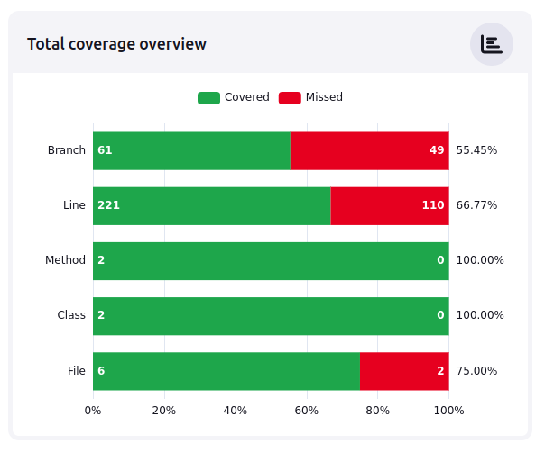
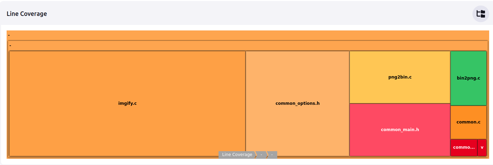
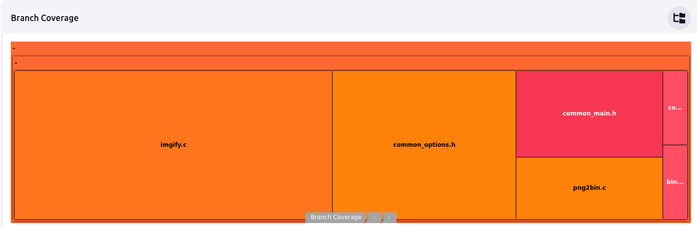
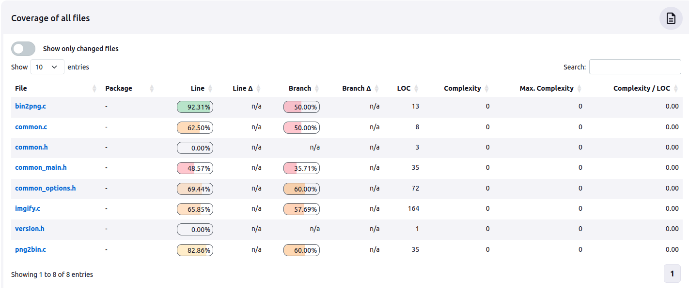

Вариант 4
======================
Задание 2
======================
Денис Сутягин
======================

Исходные данные
----------------------
Проект [https://github.com/jweyrich/imgify](imgify), ветка master

Отчет
----------------------
1. Порядок сборки ОО с инструментацией для анализа покрытия кода imgify

Сборка с покрытием происходит вызовом make с необходимыми опциями компиляции:
```bash
    make -j8 CFLAGS="-g -Wall -fprofile-instr-generate -fcoverage-mapping"
```

2. Порядок запуска тестирования и оценки покрытия

Сделал отдельную ветку кодв в репозитории https://github.com/drJabber/ispras-fuzz.git - imgify-build/cov01
В новой ветке изменен докерфайл образа, в котором происходит сборка - используется Dockerfile.cov01
В новом образе доустанавливаются пакеты, необходимые для сбора покрытия и формирования отчета
- p7zip-full - для распаковки архива с тестовыми данными png
- p7zip-rar 
- llvm - для установки llvm-lcov 
- python3-pip - для установки пакетов python

Также в новом сборочном образе устанавливается пакет python - lcov_coberture - для преобразования формата покрытия lcov в формат Coberture xml.
Кроме того в новый образ помещается прекомпилированное ПО radamsa для генерации тестовых файлов bin, а также скрипт, который формирует тестовые данные для собираемых в проекте imgify программ png2bin и bin2png, запускает тесты и собирает тестовое покрытие (setup_tests.sh).

```Dockerfile
FROM aflplusplus/aflplusplus:stable
ARG DEBIAN_FRONTEND=noninteractive
RUN cat /etc/os-release && \
    apt update && \
    apt install -y libpng-dev p7zip-full p7zip-rar llvm  python3-pip && \
    # unlink /etc/localtime && \
    # ln -s /usr/share/zoneinfo/Europe/Moscow /etc/localtime && \
    pip3 install lcov_cobertura

COPY .scripts/ /tmp
COPY .scripts/setup_tests.sh /tmp/.scripts/setup_tests.sh
COPY .scripts/radamsa /tmp/.scripts/radamsa
```

- тесты png2bin

Скрипт setup_tests загружает в workspace тестовый набор изображений png, распаковывает и для каждого изображения запускает тест png2bin со сбором покрытия:
```bash
test_pngs=(./test/png/*.png)
for png in ${test_pngs[@]:0:20}; 
do 
    LLVM_PROFILE_FILE="./.coverage/png2bin.profraw" ./png2bin -i $png -o ${png}".bin" -p 0 || true; 
done
```

- тесты bin2png

Скрипт setup_tests формирует из случайных данных, сгенерированных программой radamsa тестовые файлы bin и для каждого такого файла запускает тест bin2png со сбором покрытия:

```bash
/tmp/.scripts/radamsa --generators random -n 30 -o ./test/bin/test-%02n.bin
test_bins=(./test/bin/*.bin)
for bin in ${test_bins[@]:0:30}; 
do 
    LLVM_PROFILE_FILE="./.coverage/bin2png.profraw" ./bin2png -i $bin -o ${bin}".png" -p $(($RANDOM % 300)) || true; # 300>256, so paths with -p errors also will be covered
done
```

- преобразование формата покрытия

После прогона тестов скрипт setup_tests выполняет объединение raw файлов покрытия, преобразование их в формат lcov и далее - проеобразование их к формату Coberture - для того чтобы их можно было отображать в плагине Coverage дженкинса
```bash
llvm-profdata merge -sparse ./.coverage/png2bin.profraw ./.coverage/bin2png.profraw -o ./.coverage/imgify.profdata
llvm-cov export ./png2bin -instr-profile=./.coverage/imgify.profdata -format=lcov > ./.coverage/imgify.png2bin.lcov
llvm-cov export ./bin2png -instr-profile=./.coverage/imgify.profdata -format=lcov > ./.coverage/imgify.bin2png.lcov
lcov_cobertura ./.coverage/imgify.png2bin.lcov -b ./ -o ./.coverage/coverage-imgify-png2bin.xml
lcov_cobertura ./.coverage/imgify.bin2png.lcov -b ./ -o ./.coverage/coverage-imgify-bin2png.xml
```

- результаты анализа покрытия

Общее покрытие:


Покрытие по строкам кода:


Покрытие по ветвям:


Покрытие пофайлово:


Судя по высокому уровню покрытия кода - более 80% в модулях png2bin/bin2png и более 65% в imgify - где сосредоточена большая часть кода проекта - набор тестов оказался достаточно качественный.

Для улучшения покрытия - необходимо смоделировать ситуации с ошибочными входными параметрами - например - несуществующие файлы, директории readonly, кривые png с несуществующими цветами, бинарные файлы, забитые байтом #0 и т.д.

3. Сборка с включенными санитайзерами

При сборке с включенными санитайзерами и сборкой покрытия:

```bash
 make -j8 CFLAGS="-g -Wall -fprofile-instr-generate -fcoverage-mapping  \
                          -fsanitize=address -fsanitize=pointer-compare -fsanitize=pointer-subtract -fsanitize=leak \
                          -fsanitize-address-use-after-scope -fsanitize=unreachable -fsanitize=undefined -fcf-protection=full \
                          -fstack-check -fstack-protector-all"
```

В процессе запуска тестов png2bin срабатывают санитайзеры - на переполнение буфера на куче, в двух участках кода imgify:
```log
test png2bin
=================================================================
==65==ERROR: AddressSanitizer: heap-buffer-overflow on address 0x60200000001e at pc 0x555c1eae3903 bp 0x7ffcbe716120 sp 0x7ffcbe7158e8
WRITE of size 2 at 0x60200000001e thread T0
    #0 0x555c1eae3902 in __interceptor_memcpy (/var/lib/jenkins/workspace/tcpdump_imgify-build_cov01_2@2/png2bin+0x3a902) (BuildId: a9eb06ff904c60d9e3d9c2e8de120f3966b274fb)
    #1 0x7fbc1c3bdcdc  (/lib/x86_64-linux-gnu/libpng16.so.16+0x18cdc) (BuildId: d58bf7c11ac793d528926238d831792b5ef792cf)
    #2 0x7fbc1c3b323a in png_read_row (/lib/x86_64-linux-gnu/libpng16.so.16+0xe23a) (BuildId: d58bf7c11ac793d528926238d831792b5ef792cf)
    #3 0x7fbc1c3b6b10 in png_read_image (/lib/x86_64-linux-gnu/libpng16.so.16+0x11b10) (BuildId: d58bf7c11ac793d528926238d831792b5ef792cf)
    #4 0x555c1eb8a015 in png_load /var/lib/jenkins/workspace/tcpdump_imgify-build_cov01_2@2/imgify.c:135:2
    #5 0x555c1eb88331 in do_work /var/lib/jenkins/workspace/tcpdump_imgify-build_cov01_2@2/png2bin.c:43:18
    #6 0x555c1eb874b2 in main /var/lib/jenkins/workspace/tcpdump_imgify-build_cov01_2@2/./common_main.h:36:2
    #7 0x7fbc1c09fd8f  (/lib/x86_64-linux-gnu/libc.so.6+0x29d8f) (BuildId: a43bfc8428df6623cd498c9c0caeb91aec9be4f9)
    #8 0x7fbc1c09fe3f in __libc_start_main (/lib/x86_64-linux-gnu/libc.so.6+0x29e3f) (BuildId: a43bfc8428df6623cd498c9c0caeb91aec9be4f9)
    #9 0x555c1eac9574 in _start (/var/lib/jenkins/workspace/tcpdump_imgify-build_cov01_2@2/png2bin+0x20574) (BuildId: a9eb06ff904c60d9e3d9c2e8de120f3966b274fb)

0x60200000001e is located 2 bytes to the right of 12-byte region [0x602000000010,0x60200000001c)
allocated by thread T0 here:
    #0 0x555c1eb4c3be in __interceptor_malloc (/var/lib/jenkins/workspace/tcpdump_imgify-build_cov01_2@2/png2bin+0xa33be) (BuildId: a9eb06ff904c60d9e3d9c2e8de120f3966b274fb)
    #1 0x555c1eb89c8b in png_load /var/lib/jenkins/workspace/tcpdump_imgify-build_cov01_2@2/imgify.c:117:18
    #2 0x555c1eb88331 in do_work /var/lib/jenkins/workspace/tcpdump_imgify-build_cov01_2@2/png2bin.c:43:18
    #3 0x555c1eb874b2 in main /var/lib/jenkins/workspace/tcpdump_imgify-build_cov01_2@2/./common_main.h:36:2
    #4 0x7fbc1c09fd8f  (/lib/x86_64-linux-gnu/libc.so.6+0x29d8f) (BuildId: a43bfc8428df6623cd498c9c0caeb91aec9be4f9)

```
и 
```log
==83==ERROR: AddressSanitizer: heap-buffer-overflow on address 0x6070000000a6 at pc 0x5620ff0e72a9 bp 0x7fff48821df0 sp 0x7fff48821de8
READ of size 1 at 0x6070000000a6 thread T0
    #0 0x5620ff0e72a8 in png_load /var/lib/jenkins/workspace/tcpdump_imgify-build_cov01_2@2/imgify.c:149:7
    #1 0x5620ff0e5331 in do_work /var/lib/jenkins/workspace/tcpdump_imgify-build_cov01_2@2/png2bin.c:43:18
    #2 0x5620ff0e44b2 in main /var/lib/jenkins/workspace/tcpdump_imgify-build_cov01_2@2/./common_main.h:36:2
    #3 0x7f4358fa1d8f  (/lib/x86_64-linux-gnu/libc.so.6+0x29d8f) (BuildId: a43bfc8428df6623cd498c9c0caeb91aec9be4f9)
    #4 0x7f4358fa1e3f in __libc_start_main (/lib/x86_64-linux-gnu/libc.so.6+0x29e3f) (BuildId: a43bfc8428df6623cd498c9c0caeb91aec9be4f9)
    #5 0x5620ff026574 in _start (/var/lib/jenkins/workspace/tcpdump_imgify-build_cov01_2@2/png2bin+0x20574) (BuildId: a9eb06ff904c60d9e3d9c2e8de120f3966b274fb)

0x6070000000a6 is located 64 bytes to the right of 70-byte region [0x607000000020,0x607000000066)
allocated by thread T0 here:
    #0 0x5620ff0a93be in __interceptor_malloc (/var/lib/jenkins/workspace/tcpdump_imgify-build_cov01_2@2/png2bin+0xa33be) (BuildId: a9eb06ff904c60d9e3d9c2e8de120f3966b274fb)
    #1 0x5620ff0e6c8b in png_load /var/lib/jenkins/workspace/tcpdump_imgify-build_cov01_2@2/imgify.c:117:18
    #2 0x5620ff0e5331 in do_work /var/lib/jenkins/workspace/tcpdump_imgify-build_cov01_2@2/png2bin.c:43:18
    #3 0x5620ff0e44b2 in main /var/lib/jenkins/workspace/tcpdump_imgify-build_cov01_2@2/./common_main.h:36:2
    #4 0x7f4358fa1d8f  (/lib/x86_64-linux-gnu/libc.so.6+0x29d8f) (BuildId: a43bfc8428df6623cd498c9c0caeb91aec9be4f9)
```

При проведении тестов bin2png ошибки не были обнаружены

Покрытие кода при сборке с санитайзерами не меняется

4. Особенности сбора покрытия

Поскольку код imgify по умолчанию собирается clang - для включения сбора покрытия используются опции компиляции *-fprofile-instr-generate -fcoverage-mapping*
При сборе покрытия в процессе тестирования используется переменная окружения *LLVM_PROFILE_FILE* для указания файла, в который собирается покрытие.
Не смог, как изначально планировал, использовать *gcovr* для преобразования собранного покрытия формат Coberture, как и в любой другой в читаемый вид, поэтому пришлось использовать преобразование *profdata -> lcov -> coberture xml*

5. Установка Jenkins, создание заданий на сборку
- создал ВМ ubuntu 22.04
- установил Jenkins
```bash
sudo apt-get install jenkins
```
- установил jdk
```bash
sudo apt install default-jre
```
- установил docker-ce, добавил текущему пользователю и дженкинсу права на докер
```bash
echo "deb [arch=$(dpkg --print-architecture) signed-by=/usr/share/keyrings/docker-archive-keyring.gpg] https://download.docker.com/linux/ubuntu $(lsb_release -cs) stable" | sudo tee /etc/apt/sources.list.d/docker.list > /dev/null

sudo apt install docker-ce=5:24.0.6-1~ubuntu.22.04~jammy

sudo usermod -aG docker jenkins
sudo usermod -aG docker ${USER}
```
- создал на гитхабе PAT - для возможности скачивания дженкинсом кода с гитхаба
- прописал PAT в разделе credentials конфигурации дженкинса с идентификатором "gh-ci"
- создал в дженкинсе multibranch pipeline "ipras-fuzz", прописал там как источник веток репозиторий на гитхабе https://github.com/drJabber/ispras-fuzz.git 
- ветки проекта https://github.com/drJabber/ispras-fuzz.git соержат Jenkinsfile и Dockerfile для соответствующей версии собираемого кода
- Jenkins вытаскивает из гитхаба все ветки, которые имеются в проекте и исполняет файлы Jenkinsfile, которые находятся в этом проекте
- проект https://github.com/drJabber/ispras-fuzz.git также содержит Dockerfile для сборки образа с afl++ и зависимостями собираемого проекта (imgify)
- в процессе исполнения Jenkinfile дженкинс собирает образ с необходимыми зависимостями и выполняет внутри образа загрузку кода собираемого проекта imgify и собирает его с соответствующими опциями компилятора в зависимости от версии (релизная, отладочная инструментированная)
- итого, чтобы добавить еще одно задание на сборку - необходимо создать в проекте ispras-fuzz по одной ветке для каждой версии нового ПО, изменить Dockerfile, чтобы добавить зависимости нового проекта, изменить Jenkinsfile, чтобы прописать там url нового проекта, добавить необходимые патчи и опции компилятора
- добавил плагин code coverage, который умеет отображать данные покрытия в формате Coberture - теперь после прогона пайплайна в дженкинсе можно смотреть данные покрытия.

PS
--------------
Dockerfile - для инструментированной версии со сбором покрытия:
```Dockerfile
FROM aflplusplus/aflplusplus:stable
ARG DEBIAN_FRONTEND=noninteractive
RUN cat /etc/os-release && \
    apt update && \
    apt install -y libpng-dev p7zip-full p7zip-rar llvm python3-pip && \
    # unlink /etc/localtime && \
    # ln -s /usr/share/zoneinfo/Europe/Moscow /etc/localtime && \
    pip3 install lcov_cobertura

COPY .scripts/ /tmp
COPY .scripts/setup_tests.sh /tmp/.scripts/setup_tests.sh
COPY .scripts/radamsa /tmp/.scripts/radamsa
```

Jenkinsfile - для инструментированной версии со сбором покрытия и включенными датчиками
```Jenkinsfile
pipeline {
  agent any
  stages {
    stage("build") {
        agent {
            // dockerfile true
            dockerfile {
              filename 'Dockerfile.cov01'
            }
        }
        steps {
          checkout([
              $class: 'GitSCM',
              branches: [[name: 'master']],
              extensions: [[$class: 'CloneOption', shallow: false, depth: 0, reference: '']],
              userRemoteConfigs: [[credentialsId:  'gh-ci', url: "https://github.com/jweyrich/imgify.git"]],
          ])         

          sh """
             rm *.gcno *.gcda || true

             echo "patch defines"
             temp_file_name="\$(mktemp /tmp/foo.XXXXXXXXX)" && \
                cat ./png2bin.c | \
                awk -v replacement="" 'NR==30{\$0=replacement}{print}' | 
                awk -v replacement='#include \"common_options.h\"' 'NR==34{\$0=replacement}{print}' > \$temp_file_name && \
                mv -f \$temp_file_name ./png2bin.c

             echo "patch defines"
             temp_file_name="\$(mktemp /tmp/foo.XXXXXXXXX)" && \
                cat ./bin2png.c | \
                awk -v replacement="" 'NR==30{\$0=replacement}{print}' | 
                awk -v replacement='#include \"common_options.h\"' 'NR==34{\$0=replacement}{print}' > \$temp_file_name && \
                mv -f \$temp_file_name ./bin2png.c

             echo "fix double free in imgify.c 253"
             temp_file_name="\$(mktemp /tmp/foo.XXXXXXXXX)" && \
                cat ./imgify.c | \
                awk -v replacement="" 'NR==253{\$0=replacement}{print}'  > \$temp_file_name && \
                mv -f \$temp_file_name ./imgify.c


             #make -j8 CFLAGS="-g -DFORTIFY_SOURCE=2 -Wall -fsanitize=address -fsanitize=pointer-compare -fsanitize=pointer-subtract -fsanitize=leak \
             #             -fsanitize-address-use-after-scope -fsanitize=unreachable -fsanitize=undefined -fcf-protection=full \
             #             -fstack-check -fstack-protector-all --coverage"

             make -j8 CFLAGS="-g -Wall -fprofile-instr-generate -fcoverage-mapping  \
                          -fsanitize=address -fsanitize=pointer-compare -fsanitize=pointer-subtract -fsanitize=leak \
                          -fsanitize-address-use-after-scope -fsanitize=unreachable -fsanitize=undefined -fcf-protection=full \
                          -fstack-check -fstack-protector-all"
          """

          sh """
            mkdir -p ./.coverage
            /tmp/.scripts/setup_tests.sh           
          """

          recordCoverage( tools: [[parser: "COBERTURA", pattern: "**/coverage*.xml"]],
                          id: "coverage-imgify",
                          name: "Coverage for imgify projectt",
                          sourceCodeRetention: "EVERY_BUILD",
                          sourceDirectories: [[path: "./"]]
                          )

          archiveArtifacts artifacts: 'test, *.c, *.h, *.gcno, *.gcda, png2bin, bin2png'          
        }
    }    
  }
}
```

Скрипт прогона стестов и сбора покрытия
```
#!/bin/bash

mkdir -p ./test/png
mkdir -p ./test/bin

wget https://raw.githubusercontent.com/richgel999/random_pngs/main/random_pngs.7z -O ./test/png/test.7z

7z x ./test/png/test.7z -o./test/png -y
rm ./test/png/test.7z

echo "test png2bin"

test_pngs=(./test/png/*.png)
for png in ${test_pngs[@]:0:20}; 
do 
    LLVM_PROFILE_FILE="./.coverage/png2bin.profraw" ./png2bin -i $png -o ${png}".bin" -p 0 || true; 
done


echo "test bin2png"
/tmp/.scripts/radamsa --generators random -n 30 -o ./test/bin/test-%02n.bin
test_bins=(./test/bin/*.bin)
for bin in ${test_bins[@]:0:30}; 
do 
    LLVM_PROFILE_FILE="./.coverage/bin2png.profraw" ./bin2png -i $bin -o ${bin}".png" -p $(($RANDOM % 300)) || true; # 300>256, so paths with -p errors also will be covered
done

llvm-profdata merge -sparse ./.coverage/png2bin.profraw ./.coverage/bin2png.profraw -o ./.coverage/imgify.profdata
llvm-cov export ./png2bin -instr-profile=./.coverage/imgify.profdata -format=lcov > ./.coverage/imgify.png2bin.lcov
llvm-cov export ./bin2png -instr-profile=./.coverage/imgify.profdata -format=lcov > ./.coverage/imgify.bin2png.lcov
lcov_cobertura ./.coverage/imgify.png2bin.lcov -b ./ -o ./.coverage/coverage-imgify-png2bin.xml
lcov_cobertura ./.coverage/imgify.bin2png.lcov -b ./ -o ./.coverage/coverage-imgify-bin2png.xml

```